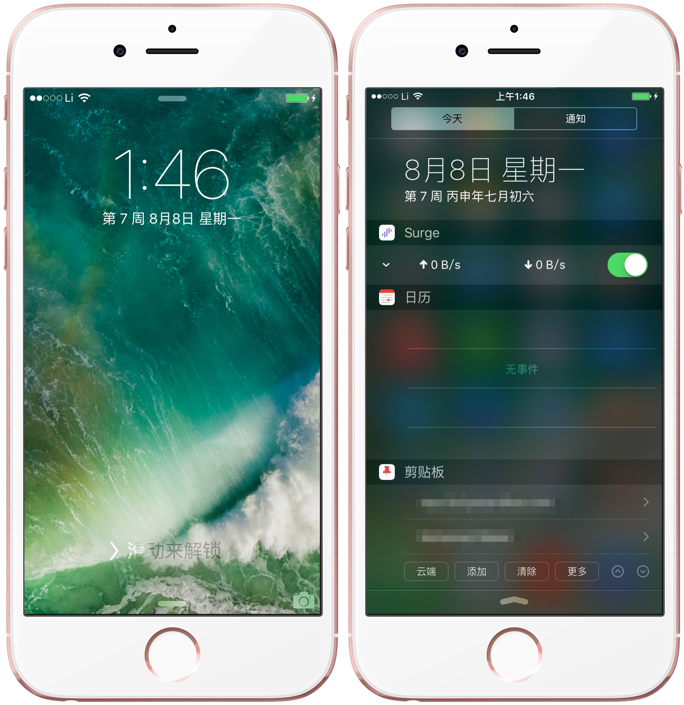
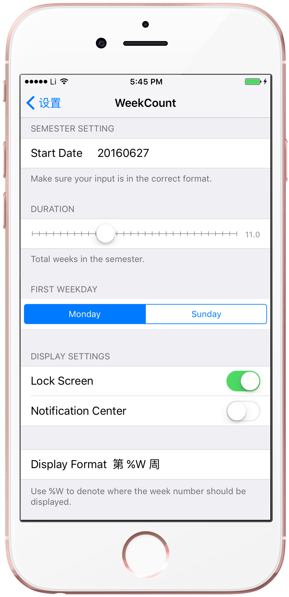

# WeekCount

Display week number on lock screen and today view.

## Description

适配 iOS 9

大学狗专用——在锁屏界面和通知中心显示学期周数。

// 似乎在非中文环境无法正常工作，iOS 9.3.3 越狱的多语言好像又有 bug，待查证。

在「设置」中进行配置。

## 其他

- Cydia 源地址：[repo.wangjinli.com](http://repo.wangjinli.com)
- 博文：[越狱开发系列（一）：让 iPhone 上显示学期周数](http://wangjinli.com/blog/2016/08/jailbreak-development-1-0/)
- [macOS 版本](https://github.com/JeziL/WeekCount)